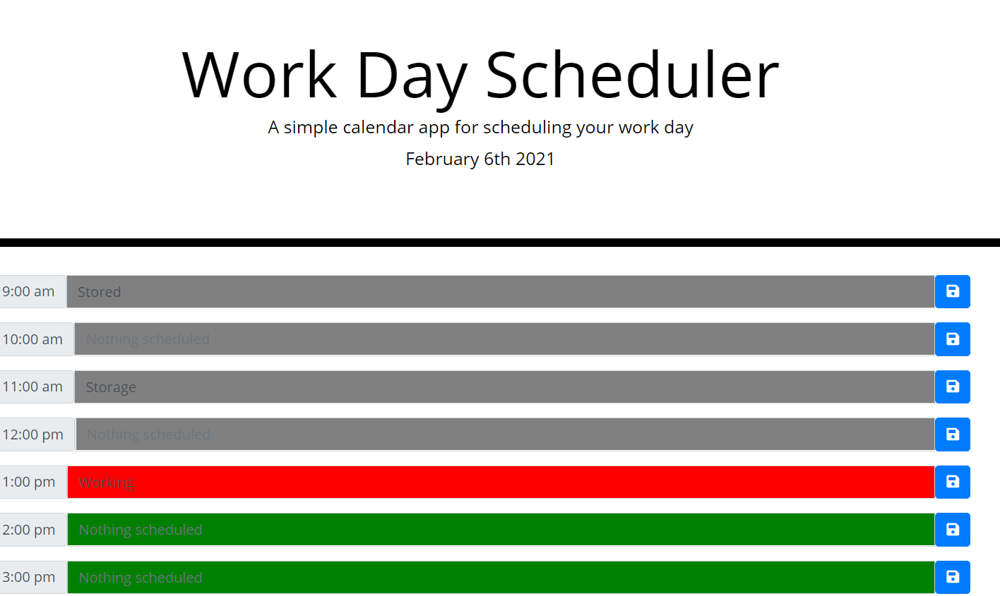
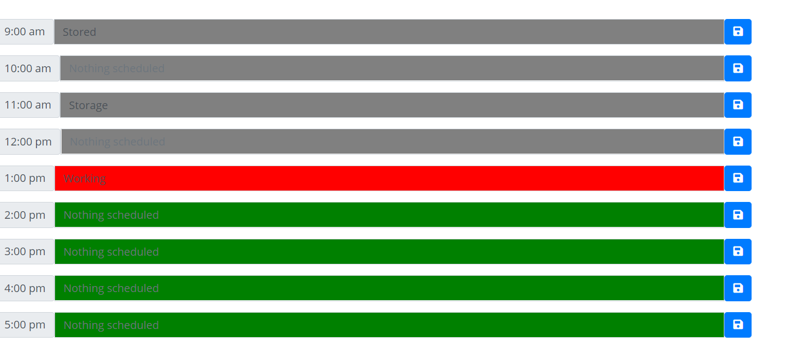

# Day-Planner
Planner will track the hour of the day and colour each planner slot to indicate if the hour is past, current or upcoming. Any information saved into the planner by clicking the button beside the relevant form will be saved to local storage and available upon reloading the application. 

https://benelliott111.github.io/Day-Planner/

